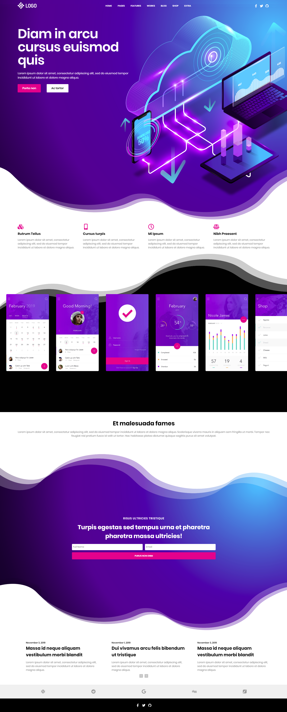
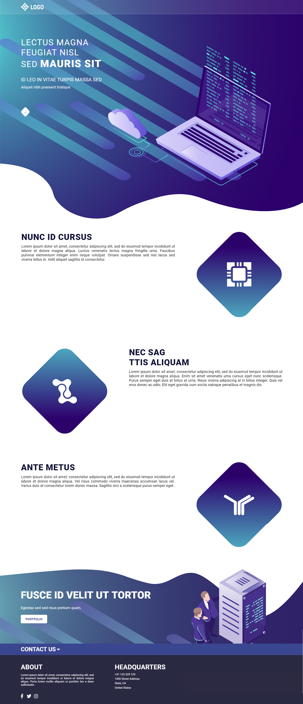

##### November 3, 2019

# Custom front end templates
A collection of responsive single-page templates I made from scratch in order to improve my front end skills. Made using JS/CSS/HTML and React. No jQuery.

## Templates
##### Template 1
- Source code: [src](https://github.com/JThissen/Custom-front-end-templates/tree/master/template_1/src)
- Hosted on Github pages: https://jthissen.github.io/Custom-front-end-templates/
- Isometric art by  https://www.freepik.com/pikisuperstar

##### Template 2
- Source code: [src](https://github.com/JThissen/Custom-front-end-templates/tree/master/template_2/src)
- Isometric art by  https://www.freepik.com/fullvector

##### Icons by https://fontawesome.com/

## Folder structure
```
├───template_1
│   ├───build
│   │   └───static
│   │       ├───css
│   │       ├───js
│   │       └───media
│   ├───public
│   ├───screenshots
│   └───src
│       ├───CSS
│       ├───Images
│       └───JS
└───template_2
    ├───build
    │   └───static
    │       ├───css
    │       ├───js
    │       └───media
    ├───public
    ├───screenshots
    └───src
        ├───Css
        └───Images
```

## Screenshots
### Template 1


### Template 2

